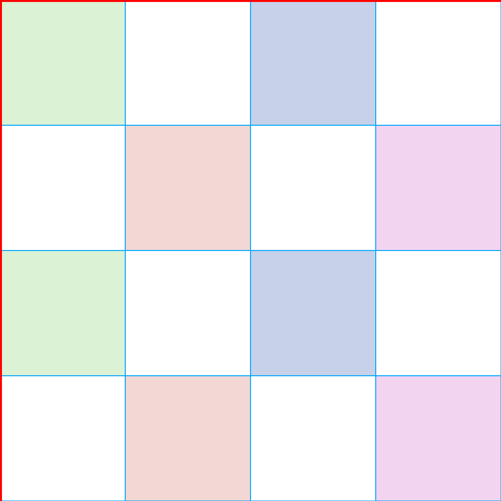
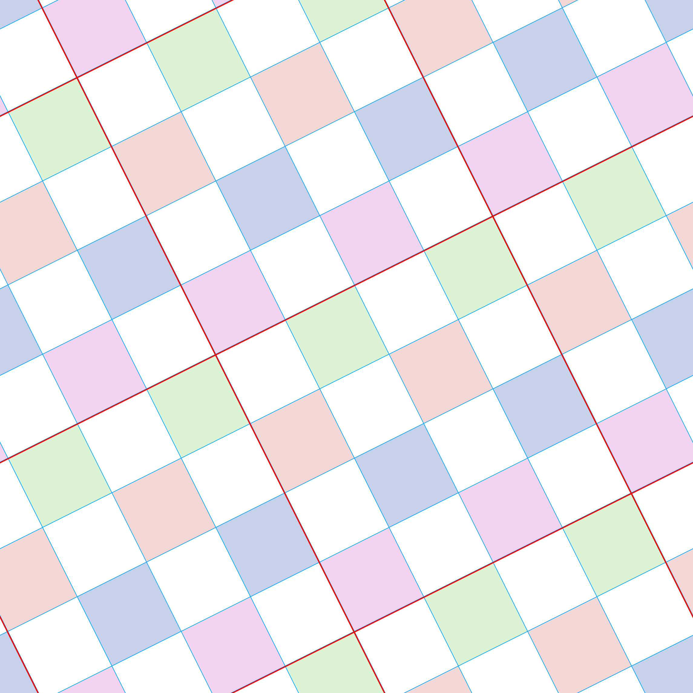
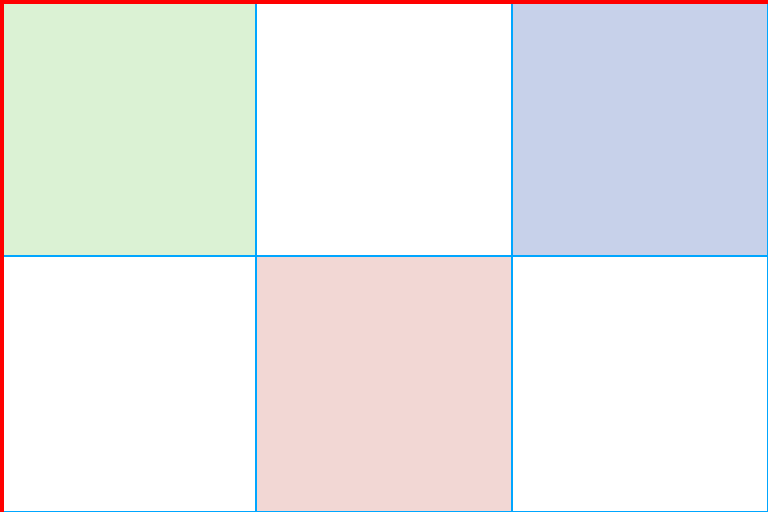
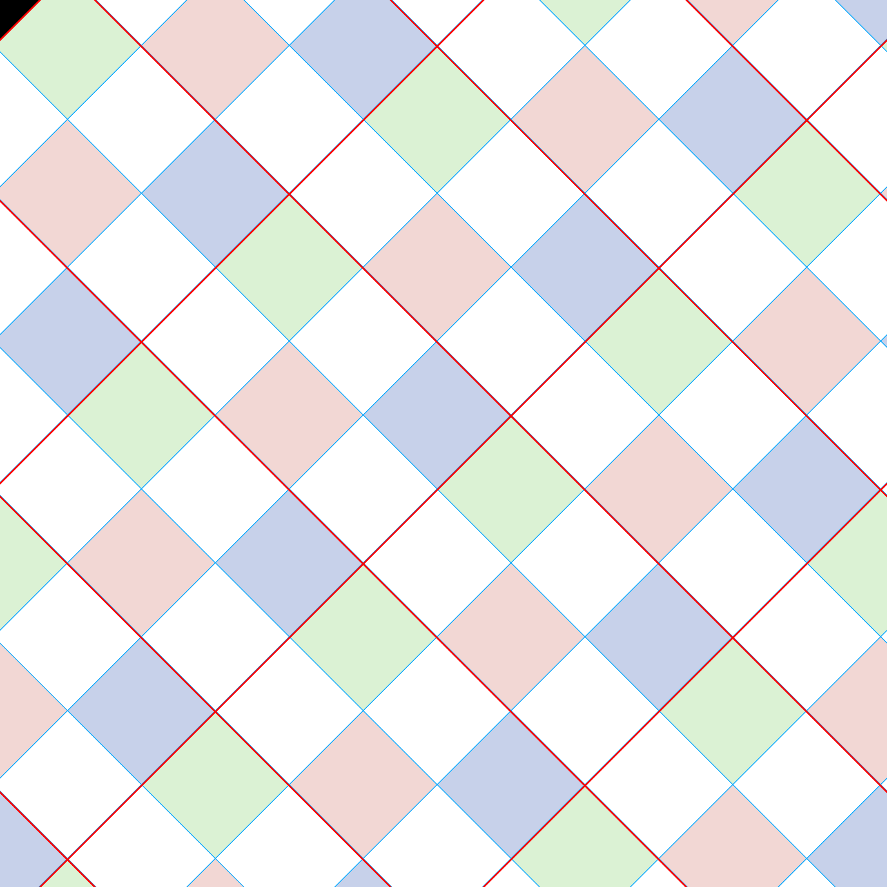

# WTC Tile Maker (Deno + Sharp)

## Problem Statement

When generating tiles for websites, designers and developers often encounter issues when rotating tiles. Common solutions involve less-than-ideal hacks, such as adding pseudoelements, scaling, and rotating them to achieve the desired effect. These workarounds can complicate code, reduce performance, and make maintenance harder.

WTC Tile Maker aims to solve this by providing a robust, programmatic solution for generating and manipulating tiles, including rotation, without relying on CSS hacks.

---

## Quick Start

Generate a seamlessly tileable rotated version of your image:

```sh
# Rotate an image to 45 degrees
deno run -A main.ts generate -d 45 input.png

# Or use a preset angle index (run 'list' to see all options)
deno run -A main.ts generate -a 3 input.png

# List all available rational angles
deno run -A main.ts list

# Help
deno run -A main.ts help

```

The output file will be saved in the same directory as the input with the angle appended to the filename (e.g., `input-tile-45.png`).

---

## Development

### Prerequisites

- [Deno](https://deno.com/) installed
- [Sharp](https://deno.land/x/sharp) module available

### Running the Project

1. Clone the repository:
   ```sh
   git clone https://github.com/wethegit/wtc-tile-maker-deno-sharp.git
   cd wtc-tile-maker-deno-sharp
   ```
2. Run the main script:
   ```sh
   deno run -A main.ts
   ```

### Running Tests

To run the test suite:

```sh
deno task test
```

Or run tests directly:

```sh
deno test --allow-all
```

---

## CLI Usage

### Commands

| Command    | Description                                 |
| ---------- | ------------------------------------------- |
| `help`     | Display the help message                    |
| `list`     | List available rational angles              |
| `generate` | Generate a tile pattern from an input image |
| `version`  | Show version information                    |

### Options for `generate`

| Option                    | Description                                              |
| ------------------------- | -------------------------------------------------------- |
| `-a, --angleOption`       | Index of rational angle to use (default: 0)              |
| `-d, --degrees`           | Desired angle in degrees (overrides angleOption)         |
| `-o, --output`            | Output file name (default: derived from input)           |
| `-s, --maxValidSize`      | Maximum valid dimension for output tiles (default: 2000) |
| `-l, --allowLargeBuffers` | Allow processing of large image buffers (default: false) |
| `-q, --quality`           | Quality of the output image (default: 90)                |
| `-m, --tileMargin`        | Margin around tiles (default: 1)                         |
| `-v, --verbose`           | Enable verbose output (default: false)                   |

---

## Available Rational Angles

These are the angles where `tan(θ) = m/n` for small integers m, n. These angles produce periodic tilings when used for rotation.

| Index | Label                  | m   | n   |
| ----- | ---------------------- | --- | --- |
| 0     | 0°                     | 0   | 1   |
| 1     | 90°                    | 1   | 0   |
| 2     | -90°                   | -1  | 0   |
| 3     | 45°                    | 1   | 1   |
| 4     | -45°                   | -1  | 1   |
| 5     | 26.565° (arctan 1/2)   | 1   | 2   |
| 6     | -26.565° (arctan -1/2) | -1  | 2   |
| 7     | 63.435° (arctan 2)     | 2   | 1   |
| 8     | -63.435° (arctan -2)   | -2  | 1   |
| 9     | 18.435° (arctan 1/3)   | 1   | 3   |
| 10    | -18.435° (arctan -1/3) | -1  | 3   |
| 11    | 71.565° (arctan 3)     | 3   | 1   |
| 12    | -71.565° (arctan -3)   | -3  | 1   |
| 13    | 14.036° (arctan 1/4)   | 1   | 4   |
| 14    | -14.036° (arctan -1/4) | -1  | 4   |
| 15    | 75.964° (arctan 4)     | 4   | 1   |
| 16    | -75.964° (arctan -4)   | -4  | 1   |
| 17    | 33.690° (arctan 2/3)   | 2   | 3   |
| 18    | -33.690° (arctan -2/3) | -2  | 3   |
| 19    | 56.310° (arctan 3/2)   | 3   | 2   |
| 20    | -56.310° (arctan -3/2) | -3  | 2   |
| 21    | 36.870° (arctan 3/4)   | 3   | 4   |
| 22    | -36.870° (arctan -3/4) | -3  | 4   |
| 23    | 53.130° (arctan 4/3)   | 4   | 3   |
| 24    | -53.130° (arctan -4/3) | -4  | 3   |
| 25    | 11.310° (arctan 1/5)   | 1   | 5   |
| 26    | -11.310° (arctan -1/5) | -1  | 5   |
| 27    | 78.690° (arctan 5)     | 5   | 1   |
| 28    | -78.690° (arctan -5)   | -5  | 1   |

You can also run `deno -A main.ts list` to see these angles.

---

## Recommended Input Aspect Ratios

The output tile size depends on how well the input dimensions align with the m:n ratios of the angles. For best results, use these aspect ratios:

### Best Aspect Ratios

| Aspect Ratio       | Works Best With Angles   | Notes                                            |
| ------------------ | ------------------------ | ------------------------------------------------ |
| **1:1** (square)   | All angles               | Always produces predictable, symmetrical outputs |
| **2:1** or **1:2** | arctan(1/2), arctan(2)   | Aligns perfectly with 26.565° and 63.435°        |
| **3:2** or **2:3** | arctan(2/3), arctan(3/2) | Good for 33.69° and 56.31°; common photo ratio   |
| **4:3** or **3:4** | arctan(3/4), arctan(4/3) | Good for 36.87° and 53.13°; classic screen ratio |
| **3:1** or **1:3** | arctan(1/3), arctan(3)   | Good for 18.435° and 71.565°                     |
| **4:1** or **1:4** | arctan(1/4), arctan(4)   | Good for 14.036° and 75.964°                     |
| **5:1** or **1:5** | arctan(1/5), arctan(5)   | Good for 11.31° and 78.69°                       |

### Ratios to Avoid

Aspect ratios with **prime numbers > 5** (like 7:3, 11:4, 13:8) or **irrational proportions** will produce larger outputs because the GCD calculations yield smaller divisors.

---

## Usage Examples

### Show Help

```sh
deno -A main.ts help
```

### List Available Rational Angles

```sh
deno -A main.ts list
```

### Generate a Tile

Generate a rotated tile from `Checker.png` using angle index 27, and max size 6000:

| Step    | Description                                                                           | Example                                           |
| ------- | ------------------------------------------------------------------------------------- | ------------------------------------------------- |
| Input   | Source image to be tiled and rotated.                                                 |              |
| Command | Command to generate a rotated tile using angle index 27, margin 3, and max size 6000. | `generate -lv -a 27 -s 6000 Checker.png`          |
| Output  | Resulting seamlessly tileable image after processing.                                 |  |

This will also work with images of different aspect ratios (like 3×2). For example. this enerates a rotated tile from `3x2-checker.png` using 45°:

| Step    | Description                                      | Example                                           |
| ------- | ------------------------------------------------ | ------------------------------------------------- |
| Input   | Source image with 3×2 aspect ratio.              |          |
| Command | Command to generate a rotated tile at 45°.       | `generate -d 45 3x2-checker.png`                  |
| Output  | Seamlessly tileable image after rotating at 45°. |  |

_N.B._ Notice, here, how there seems to be a piece missing! This is because the default tile margin is too small to make these rotated tiles cover the output dimensions. This command should be updated to `generate -m 2 -d 45 3x2-checker.png`.

#### A warning about sizes and appropriate aspect ratios

Sometimes, a combination of input size and rotation will produce an output that is either too large or creating an appropriate output tile is just beyong the capabilities of this math. In this case you should likely fall back to hacky methods or get a tile produces in a more predictable aspect ratio.

### Generate with a Specific Degree

If you want to specify an angle in degrees instead of an index:

```sh
deno -A main.ts generate -d 45 Checker.png
```

The tool will find the closest rational angle and generate the tile accordingly.

---

## Common Issues

- **allowLargeBuffers**: If you receive an error about `allowLargeBuffers`, use the `-l` flag. Warning: this may affect performance, but enables processing of narrow rotation / large image combinations.
- **Missing pieces**: If the output appears to be missing pieces around the edges, try increasing the `-m` (tileMargin) value, e.g., `-m 3`.

---

## How This Works

### The Problem with Rotating Tiles

When you rotate a regular tiling pattern (like a checkerboard) by an arbitrary angle, the result doesn't tile seamlessly in the x and y direction anymore.

### Rational Angles

The key insight is that **rational angles**—angles where `tan(θ) = m/n` for small integers m and n—produce periodic tilings when used for rotation. At these specific angles, the rotated grid aligns back to integer positions, allowing seamless repetition.

For example:

- `tan(45°) = 1/1` → m=1, n=1
- `tan(26.565°) = 1/2` → m=1, n=2
- `tan(63.435°) = 2/1` → m=2, n=1

### Tile Dimension Calculation

For a rational angle with `tan(θ) = m/n`, the rotated pattern repeats at intervals of `√(m² + n²)` times the original period.

To create a seamlessly tileable output:

- The output dimensions are calculated as: `input dimensions × √(m² + n²) / gcd(m, n)`
- This ensures the rotated grid aligns back to integer positions

### The Process

1. **Input**: A tileable source image (e.g., a checkerboard pattern)
2. **Tile**: The source image is tiled into a larger canvas to provide enough material for the rotation
3. **Rotate**: The tiled canvas is rotated by the selected rational angle
4. **Crop**: A precisely calculated region is extracted that will tile seamlessly
5. **Output**: The resulting image can be used as a CSS background and will tile perfectly at the rotated angle

This approach eliminates the need for CSS hacks like pseudoelements with `transform: rotate()` and `scale()`, resulting in cleaner code, better performance, and more predictable rendering across browsers.

---
